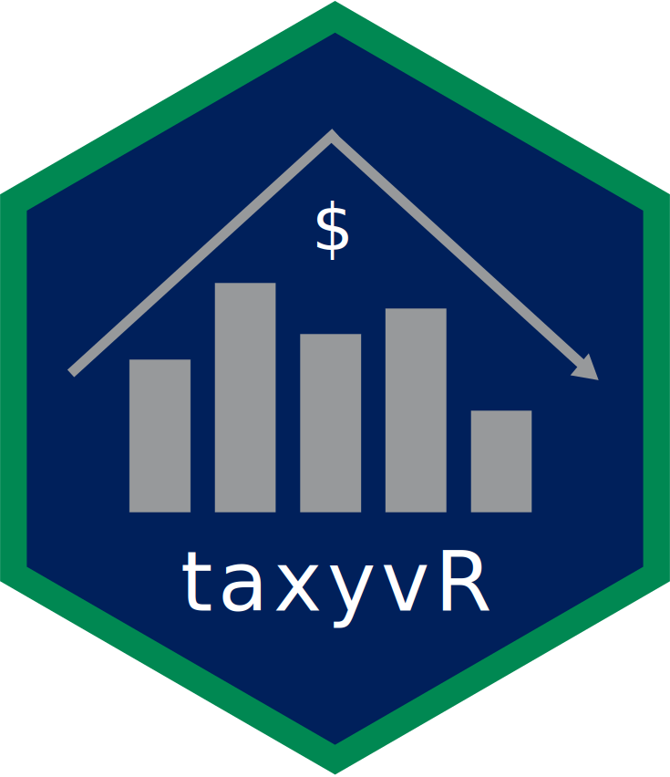

<!-- README.md is generated from README.Rmd. Please edit that file -->

# taxyvr

<!-- badges: start -->

 <!-- badges: end -->

The goal of taxyvr is to provide an easy way to access the Vancouver
housing assessment data. This is semi-tidied data obtained from the City
of Vancouver’s Open Data Portal.

## Installation

You can install the development version from
[GitHub](https://github.com/UBC-MDS/taxyvr) with:

``` r
install.packages("devtools")
devtools::install_github("UBC-MDS/taxyvr")
```

### Vignette

You may also access this information through our vignette. First use
this command for installation:

``` r
install.packages("devtools")
devtools::install_github("UBC-MDS/taxyvr", build_vignettes = TRUE)
```

And to read the vignette use:

``` r
library(taxyvr)
browseVignettes("taxyvr")
```

This data was acquired courtesy of [The city of Vancouver’s Open Data
Portal](https://opendata.vancouver.ca/pages/home/).

This Package contains (currently) 7 main dataframes all with 29 columns
:

  - `tax_2020`: This dataset is currently still being updated by the
    city as it’s still the current year. It currently has 213576 rows
    for properties in 2020
  - `tax_2019`: This contains data regarding the properties in vancouver
    for the year 2019. The values in this dataset are static and it has
    213182 rows.
  - `tax_2018`: This contains data regarding the properties in vancouver
    for the year 2018. The values in this dataset are also static and it
    has 209649 rows.  
  - `tax_2017`: This contains data regarding the properties in vancouver
    for the year 2017. The values in this dataset are also static and it
    has 206480 rows.  
  - `tax_2016`: This contains data regarding the properties in vancouver
    for the year 2016. The values in this dataset are also static and it
    has 203658 rows.  
  - `tax_2015`: This contains data regarding the properties in vancouver
    for the year 2015. The values in this dataset are also static and it
    has 203494 rows.  
  - `tax_2014`: This contains data regarding the properties in vancouver
    for the year 2014. The values in this dataset are also static and it
    has 200925 rows.

The 29 variables included in the dataset are the following, ([Vancouver
Open Data Portal documentation
page](http://www.gapminder.org/data/documentation/)):

| Variable                     | Meaning                                                                                                                                                                                         | Type | Sample                                         |
| :--------------------------- | :---------------------------------------------------------------------------------------------------------------------------------------------------------------------------------------------- | :--- | :--------------------------------------------- |
| pid                          | Property identifier                                                                                                                                                                             | chr  | <nobr>014-193-205</nobr>                       |
| legal\_type                  | Values are ‘STRATA’, indicating property is part of a Strata Plan, ‘LAND’ indicating property has a non-strata plan number, or ‘OTHER’ for properties with no plan number                       | chr  | STRATA                                         |
| folio                        | A 12-digit identifier for purposes of assessment                                                                                                                                                | dbl  | <nobr>151843410011</nobr>                      |
| land\_coordinate             | First 8 digits of BC Assessment’s folio number                                                                                                                                                  | dbl  | <nobr>15184341</nobr>                          |
| zone\_name                   | Name of zoning district                                                                                                                                                                         | chr  | <nobr>M-2</nobr>                               |
| zone\_category               | Name of zoning category                                                                                                                                                                         | chr  | <nobr>Industrial</nobr>                        |
| block                        | Component of legal description                                                                                                                                                                  | chr  | <nobr>155</nobr>                               |
| plan                         | Component of legal description                                                                                                                                                                  | chr  | <nobr>VAS2438</nobr>                           |
| district\_lot                | Component of legal description                                                                                                                                                                  | chr  | <nobr>319</nobr>                               |
| lot                          | Component of legal description                                                                                                                                                                  | chr  | <nobr>11</nobr>                                |
| from\_civic\_number          | This is the house number, it may be the first number in a range                                                                                                                                 | chr  | <nobr>3594</nobr>                              |
| to\_civic\_number            | Blank unless it is the last house number in a range                                                                                                                                             | chr  | <nobr>9141</nobr>                              |
| street\_name                 | The name of the street where the property is located                                                                                                                                            | chr  | <nobr>SHAUGHNESSY ST</nobr>                    |
| property\_postal\_code       | A series of letters and/or digits that is attached to a property address                                                                                                                        | chr  | <nobr>V6P 6R9</nobr>                           |
| narrative\_legal\_line3      | Describes a property for registration purposes                                                                                                                                                  | chr  | <nobr>SHARE IN COM PROP THEREIN</nobr>         |
| narrative\_legal\_line2      | Describes a property for registration purposes                                                                                                                                                  | chr  | <nobr>319 NEW WESTMINSTER UNDIV 74/1341</nobr> |
| narrative\_legal\_line1      | Describes a property for registration purposes                                                                                                                                                  | chr  | <nobr>DIV 376/127 LOT 220 PLAN LMS1863 </nobr> |
| narrative\_legal\_line4      | Describes a property for registration purposes                                                                                                                                                  | chr  | <nobr>WESTMINSTER LAND DIST</nobr>             |
| narrative\_legal\_line5      | Describes a property for registration purposes                                                                                                                                                  | chr  | <nobr>BLOCK 17, PLAN VAP5928 /nobr\>           |
| current\_land\_value         | The market value of the fee simple interest in land and improvements                                                                                                                            | dbl  | <nobr>397000</nobr>                            |
| current\_improvement\_value  | The market value of the fee simple interest in land and improvements                                                                                                                            | dbl  | <nobr>107000</nobr>                            |
| tax\_assessment\_year        | Year in effect for Current\_Land\_Value, Current\_Improvement\_Value and Tax\_Levy                                                                                                              | dbl  | <nobr>2018</nobr>                              |
| previous\_improvement\_value | Year in effect for Current\_Land\_Value, Current\_Improvement\_Value and Tax\_Levy                                                                                                              | dbl  | <nobr>112000</nobr>                            |
| previous\_land\_value        | This value is for the previous assessment year                                                                                                                                                  | dbl  | <nobr>262000</nobr>                            |
| year\_built                  | Year that the property was built                                                                                                                                                                | dbl  | <nobr>1989</nobr>                              |
| big\_improvement\_year       | Year of major improvement to the property                                                                                                                                                       | dbl  | <nobr>1989</nobr>                              |
| tax\_levy                    | This is the total taxes printed on the most recent tax notice. It includes the City’s general levy, levies for all taxing authorities, utilities, local improvements and miscellaneous charges. | dbl  | <nobr>5361.97</nobr>                           |
| tax\_levy                    | This is the total taxes printed on the most recent tax notice. It includes the City’s general levy, levies for all taxing authorities, utilities, local improvements and miscellaneous charges. | dbl  | <nobr>5361.97</nobr>                           |
| neighbourhood\_code          | This is a 3-digit number assigned by BCA which identifies the neighbourhood for the folio                                                                                                       | chr  | <nobr>018</nobr>                               |
| report\_year                 | The report year                                                                                                                                                                                 | dbl  | <nobr>2018</nobr>                              |

## Example

This is a basic example which shows you how to solve a common problem:

``` r
library(dplyr)
#> 
#> Attaching package: 'dplyr'
#> The following objects are masked from 'package:stats':
#> 
#>     filter, lag
#> The following objects are masked from 'package:base':
#> 
#>     intersect, setdiff, setequal, union
library(taxyvr)


tax_2018 %>% filter(legal_type == "LAND") %>% 
  arrange(desc(current_land_value))
#> # A tibble: 90,044 x 29
#>    pid   legal_type   folio land_coordinate zone_name zone_category block plan 
#>    <chr> <chr>        <dbl>           <dbl> <chr>     <chr>         <chr> <chr>
#>  1 003-… LAND       7.50e11        75016492 CD-1 (1)  Comprehensiv… 892   VAP2…
#>  2 019-… LAND       1.76e11        17579092 RS-1      One Family D… 1165  LMP2…
#>  3 023-… LAND       8.12e11        81227904 RS-1      One Family D… <NA>  LMP2…
#>  4 007-… LAND       1.21e11        12060807 DD        Comprehensiv… 9     VAP1…
#>  5 026-… LAND       6.38e11        63817555 M-2       Industrial    <NA>  BCP2…
#>  6 016-… LAND       2.76e10         2762196 RS-1      One Family D… <NA>  VAP2…
#>  7 008-… LAND       5.90e11        59028009 CD-1 (3B) Comprehensiv… <NA>  VAP1…
#>  8 009-… LAND       7.17e11        71715004 CD-1 (12… Comprehensiv… 1009  VAP1…
#>  9 006-… LAND       6.11e11        61110709 RS-1      One Family D… <NA>  VAP2…
#> 10 007-… LAND       7.39e11        73914897 CD-1 (65) Comprehensiv… 903   13962
#> # … with 90,034 more rows, and 21 more variables: district_lot <chr>,
#> #   lot <chr>, from_civic_number <chr>, to_civic_number <dbl>,
#> #   street_name <chr>, property_postal_code <chr>, narrative_legal_line3 <chr>,
#> #   narrative_legal_line2 <chr>, narrative_legal_line1 <chr>,
#> #   narrative_legal_line4 <chr>, narrative_legal_line5 <chr>,
#> #   current_land_value <dbl>, current_improvement_value <dbl>,
#> #   tax_assessment_year <dbl>, previous_improvement_value <dbl>,
#> #   previous_land_value <dbl>, year_built <dbl>, big_improvement_year <dbl>,
#> #   tax_levy <chr>, neighbourhood_code <chr>, report_year <dbl>
```

or find out the summary statistics of the data:

``` r
summary(tax_2018)
#>      pid             legal_type            folio           land_coordinate   
#>  Length:209649      Length:209649      Min.   :1.963e+10   Min.   : 1963206  
#>  Class :character   Class :character   1st Qu.:2.107e+11   1st Qu.:21072395  
#>  Mode  :character   Mode  :character   Median :6.122e+11   Median :61223404  
#>                                        Mean   :4.980e+11   Mean   :49797179  
#>                                        3rd Qu.:6.883e+11   3rd Qu.:68829732  
#>                                        Max.   :8.453e+11   Max.   :84531342  
#>                                                                              
#>   zone_name         zone_category         block               plan          
#>  Length:209649      Length:209649      Length:209649      Length:209649     
#>  Class :character   Class :character   Class :character   Class :character  
#>  Mode  :character   Mode  :character   Mode  :character   Mode  :character  
#>                                                                             
#>                                                                             
#>                                                                             
#>                                                                             
#>  district_lot           lot            from_civic_number  to_civic_number
#>  Length:209649      Length:209649      Length:209649      Min.   :   1   
#>  Class :character   Class :character   Class :character   1st Qu.: 950   
#>  Mode  :character   Mode  :character   Mode  :character   Median :1783   
#>                                                           Mean   :2372   
#>                                                           3rd Qu.:3318   
#>                                                           Max.   :9295   
#>                                                           NA's   :611    
#>  street_name        property_postal_code narrative_legal_line3
#>  Length:209649      Length:209649        Length:209649        
#>  Class :character   Class :character     Class :character     
#>  Mode  :character   Mode  :character     Mode  :character     
#>                                                               
#>                                                               
#>                                                               
#>                                                               
#>  narrative_legal_line2 narrative_legal_line1 narrative_legal_line4
#>  Length:209649         Length:209649         Length:209649        
#>  Class :character      Class :character      Class :character     
#>  Mode  :character      Mode  :character      Mode  :character     
#>                                                                   
#>                                                                   
#>                                                                   
#>                                                                   
#>  narrative_legal_line5 current_land_value  current_improvement_value
#>  Length:209649         Min.   :0.000e+00   Min.   :        0        
#>  Class :character      1st Qu.:4.630e+05   1st Qu.:    96200        
#>  Mode  :character      Median :1.039e+06   Median :   184000        
#>                        Mean   :1.833e+06   Mean   :   395127        
#>                        3rd Qu.:1.686e+06   3rd Qu.:   296000        
#>                        Max.   :3.517e+09   Max.   :611798000        
#>                        NA's   :3287        NA's   :3287             
#>  tax_assessment_year previous_improvement_value previous_land_value
#>  Min.   :2018        Min.   :        0          Min.   :0.000e+00  
#>  1st Qu.:2018        1st Qu.:    95200          1st Qu.:3.840e+05  
#>  Median :2018        Median :   181000          Median :9.450e+05  
#>  Mean   :2018        Mean   :   387512          Mean   :1.688e+06  
#>  3rd Qu.:2018        3rd Qu.:   289000          3rd Qu.:1.680e+06  
#>  Max.   :2018        Max.   :626232000          Max.   :3.319e+09  
#>  NA's   :3287        NA's   :7099               NA's   :7099       
#>    year_built   big_improvement_year   tax_levy         neighbourhood_code
#>  Min.   :1800   Min.   : 200         Length:209649      Length:209649     
#>  1st Qu.:1971   1st Qu.:1978         Class :character   Class :character  
#>  Median :1993   Median :1994         Mode  :character   Mode  :character  
#>  Mean   :1982   Mean   :1990                                              
#>  3rd Qu.:2005   3rd Qu.:2005                                              
#>  Max.   :2018   Max.   :2018                                              
#>  NA's   :5203   NA's   :5197                                              
#>   report_year  
#>  Min.   :2018  
#>  1st Qu.:2018  
#>  Median :2018  
#>  Mean   :2018  
#>  3rd Qu.:2018  
#>  Max.   :2018  
#> 
```

## License

taxyvr’s data is released under the Open Government Licence - Vancouver
license. See their [terms of
use](https://opendata.vancouver.ca/pages/licence/).

## Citation

Run this command to get info on how to cite this package.

``` r
citation("taxyvr")
#> 
#> To cite package 'taxyvr' in publications use:
#> 
#>   Hayley Boyce (2020). taxyvr: Data from The city of Vancouver's Open
#>   Data Portal on Vancouver property tax assessment.
#>   https://github.com/UBC-MDS/taxyvr/,
#>   https://opendata.vancouver.ca/explore/dataset/property-tax-report/information/.
#> 
#> A BibTeX entry for LaTeX users is
#> 
#>   @Manual{,
#>     title = {taxyvr: Data from The city of Vancouver's Open Data Portal on Vancouver
#> property tax assessment},
#>     author = {Hayley Boyce},
#>     year = {2020},
#>     note = {https://github.com/UBC-MDS/taxyvr/,
#> https://opendata.vancouver.ca/explore/dataset/property-tax-report/information/},
#>   }
```
