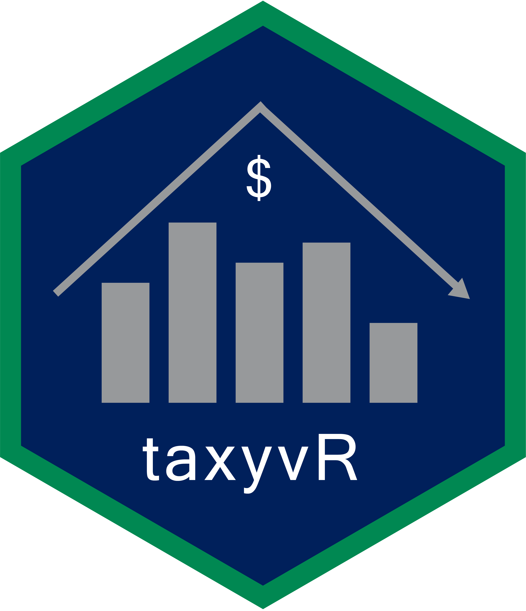

# TaxyvR 


This is semi-tidied data obtained from the City of Vancouver's Open Data Portal. It contains information on Vancouver property tax from the BC Assessment.

## Installation 

```
remotes::install_github("UBC-MDS/taxyvr")
```


